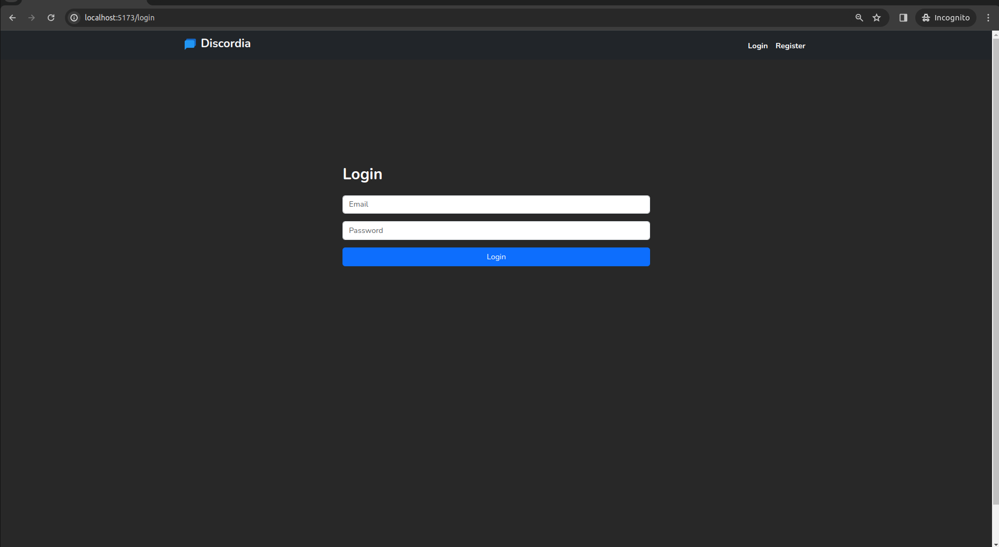
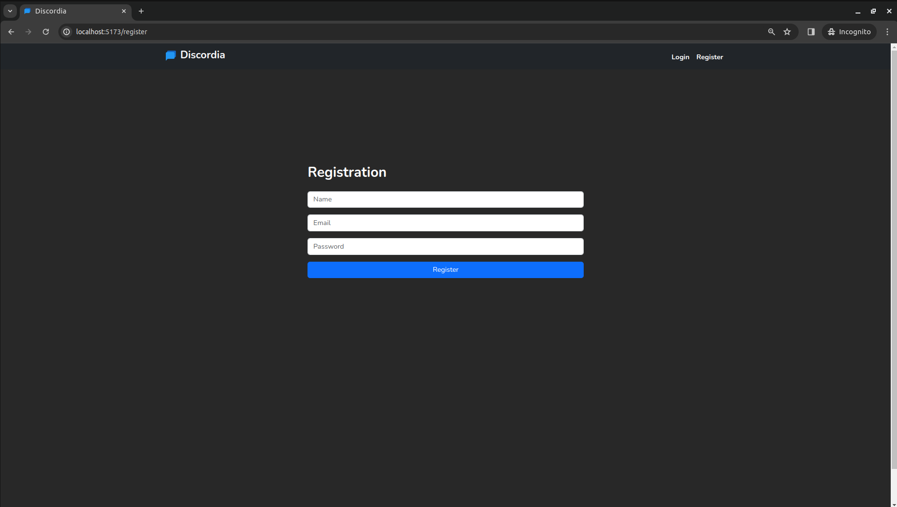
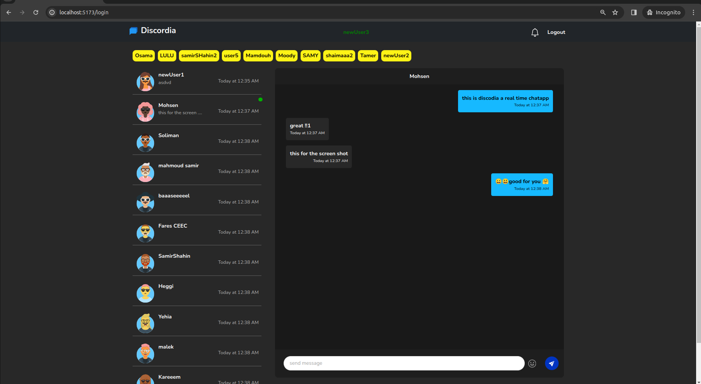
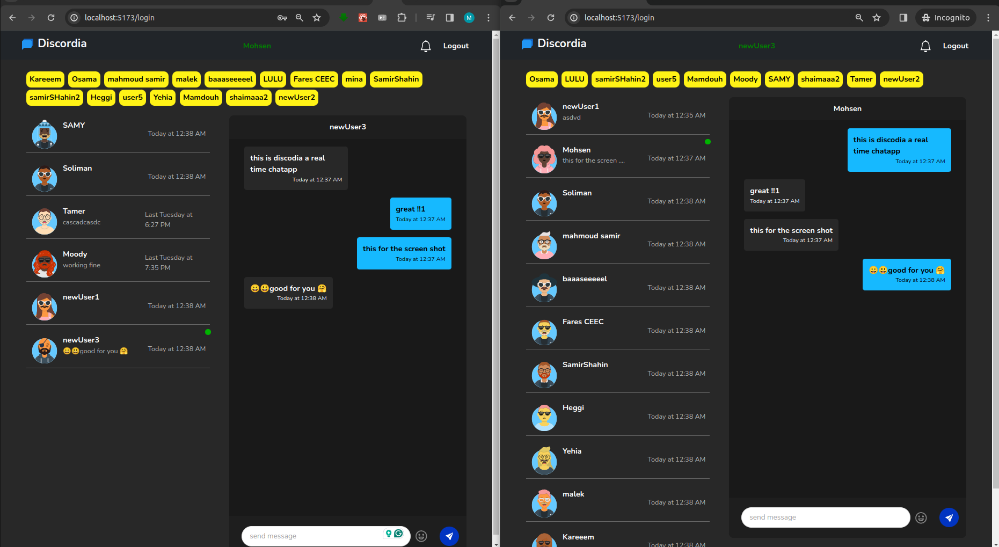

#  Discordia-RealTime-Chat-App
a realtime chatapp for messaging and notification system using socket.io and React.js. this project is built to practise and learn more about some technologies and concepts like socket.io, JWT, context API, custom hooks and more.
# main Pages 
### login page

### register page



### single user chat page



### two different users screen shot 




# full Demo and testing video 

https://github.com/mtheggi/Discordia-Realtime-ChatApp/assets/88272272/64b58196-3623-4e75-91b7-7621cdbe82df

# Testing adding a chat video 

https://github.com/mtheggi/Discordia-Realtime-ChatApp/assets/88272272/feee2a63-d02a-4045-a363-1b0f9d3546c6


# How to run the project locally
1. clone the repo 
``` bash 
    git clone https://github.com/mtheggi/Discordia-Realtime-ChatApp.git
    cd Discordia-Realtime-ChatApp
```
2. install the dependencies in both frontend , backend and socket  folders 
    to install the requirment for sockets.io ,reactJs ,and server side packages. 
```bash 
    cd frontend
    npm install
    cd ../backend
    npm install
    cd ../socket
    npm install
``` 
3. create a .env file in the backend folder and add the following 
```bash 
    PORT="choose your port number"
    ATLAS_CONNECTION_STRING="your_mongoDB_URI"
    JWT_SECRET_KEY="your_secret_key"
```
4. open [http://localhost:5173](http://localhost:5173) to view it in the browser.
### 🔺 do not use any real credentials while testing or developing the app. 🔺 
# main features in the project

* realtime messaging and notification system
* send and receive messages
* get notification when someone send a message 
* get notification when someone is online or offline

# Project Structure
* frontend : React.js
* backend : Node.js
* socket : Node.js
# future features that need to be done 
* add more features to the chat app like sending images, videos, and files
* show when someone is typing ... 
* make a light theme and dark theme toggle button 
* create group chat 
* add more security features like end-to-end encryption
* notification system like sound notification and notification settings
# NOTE 

### feel free to contribute and add more of the above features to the project. as I am looking forward for your help and support to make this project better and more useful for the community. 

# Technology used and lesson learned
* using scocket.io to create realtime chat-App for messaging and notification system 
* code reuse (custom Hooks and until functions ) .
* Authintication in Node.js using JWT .
* state management using context API.
* using MongoDB and mongoose to create and manage database.
* responsive design using bootstrap and classNames.
* route Protection in reactJs .
* separating the frontend and backend and socket server.
* backend structure and best practices.

# Acknowledgment and References used 
*this project is inspired by [Chaooo Charles](https://www.youtube.com/@ChaooCharles) tutorial
* [Web-Dev-Simplified](https://www.youtube.com/@WebDevSimplified) to learn more about custom hooks and until functions
* [socket.io](https://socket.io/) learn how to use socket.io to create a realtime chat app
* [JWT](https://jwt.io/) how to use JWT to create and manage authentication in Node.js
* [Bootstrap-ClassNames](https://getbootstrap.com/docs/4.0/getting-started/introduction/) to create responsive design

# LICENSE
MIT- License
